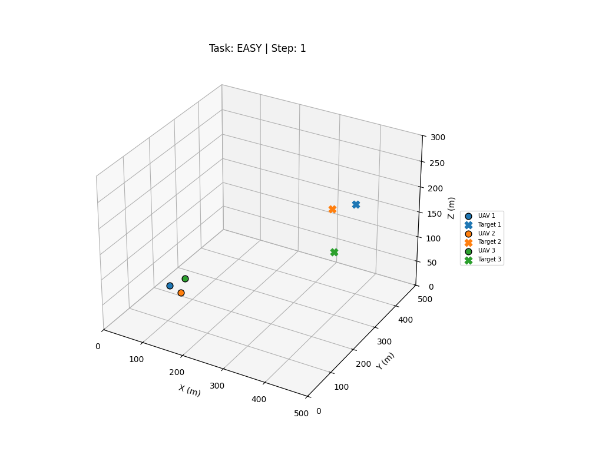
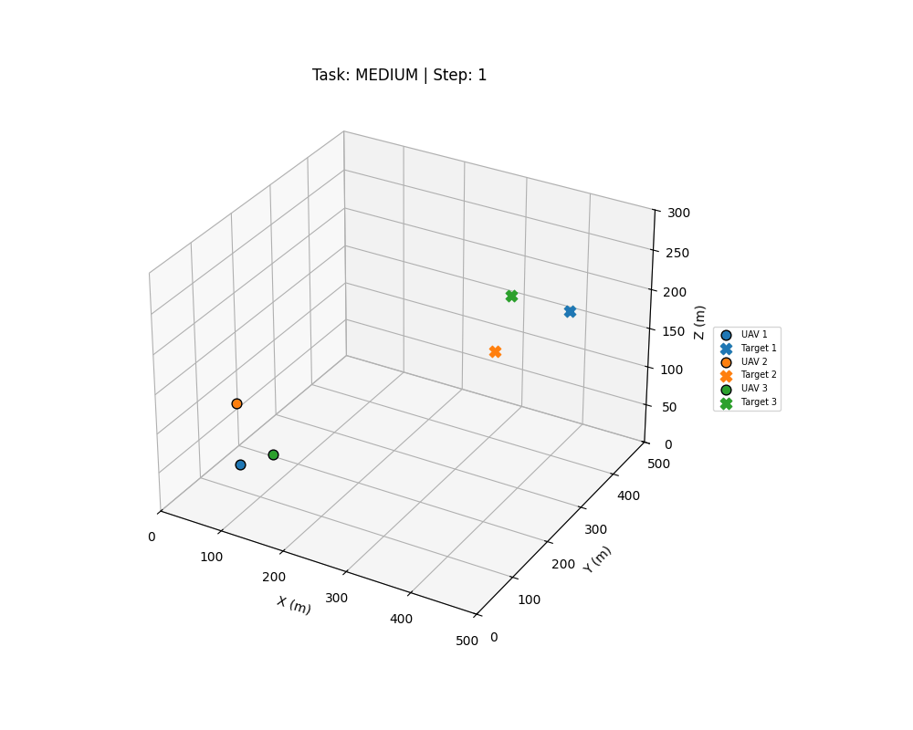
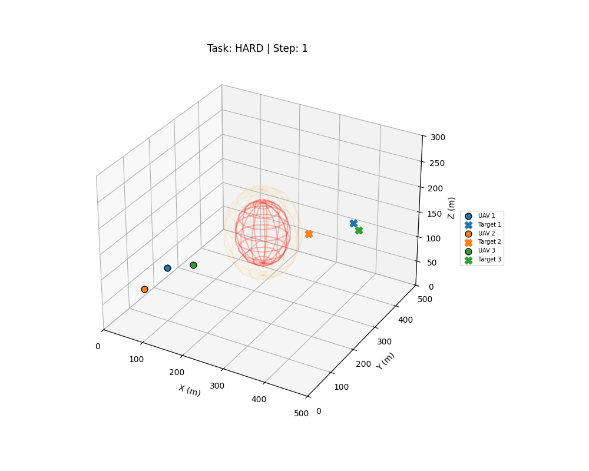
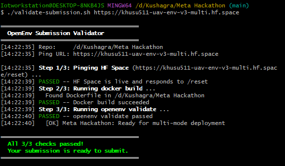

# UAV Fleet Tracking Environment — `uav_env_v3_multi`

> **Meta × PyTorch OpenEnv Hackathon**  
> Real-world RL environment: multi-UAV pursuit of evasive targets in a constrained 3-D airspace.

---

## Team — FullmetalDevs

| Name | Role |
|---|---|
| **Kushagra Gupta** | Team Lead |
| **Tanmay Sharad Mathurvaishya** | Member |
| **Shivam Chaturvedi** | Member |

---

## 🌍 Real-World Applications

This environment is designed to closely reflect real-world multi-agent UAV operations where coordination, safety, and adaptability under uncertainty are mission-critical. Each scenario maps directly to active deployment challenges in modern autonomous aerial systems.

### 🛡️ Border & Perimeter Surveillance

Modern border agencies and critical infrastructure operators increasingly rely on autonomous UAV fleets for continuous area monitoring. This environment directly models the core challenge: maintaining persistent tracking of multiple independently moving — and potentially evasive — targets across a large 3-D airspace, while enforcing hard-boundary exclusion zones that represent restricted military installations, government facilities, or protected airspace corridors. The NFZ hard-wall constraint ensures the agent learns to respect these boundaries absolutely, not just avoid them when convenient. The multi-agent coordination requirement mirrors real fleet deployments where individual UAVs must divide coverage without colliding or duplicating effort.

### 🔥 Wildfire & Disaster Response

During active wildfire operations, UAVs must track fast-moving hotspots, fire fronts, and rescue targets through intensely turbulent, unpredictable atmospheric conditions. The Ornstein–Uhlenbeck wind model in this environment directly simulates the stochastic atmospheric turbulence found near large-scale fires — where thermal columns and shifting winds can deflect a UAV's flight path by several metres per second in real time. The agent must continuously compensate for these perturbations while maintaining target pursuit, directly training the kind of adaptive flight control needed in real disaster response scenarios. The hard task's ±3 m/s wind regime is calibrated to match observed near-fire wind variability.

### 🚢 Maritime Vessel Interception

Intercepting evasive vessels — smuggling ships, illegal fishing boats, or vessels violating territorial waters — is a core Coast Guard and naval challenge. Targets do not cooperate; they actively change heading and speed when threatened. The evasive target logic in this environment (targets flee when a UAV closes within 80 m with a proximity-weighted flee vector) directly models this behaviour. Agents must learn lead-pursuit strategies rather than naive tail-chasing, predicting where a target will be rather than where it currently is. The NFZ constraint can represent territorial water boundaries or shipping exclusion zones that the intercepting fleet must not enter, adding legal compliance to the mission objective.

### 🏙️ Urban Air Traffic Management (UTM)

As urban drone delivery, inspection, and mobility services scale, coordinating hundreds of simultaneous UAV operations over populated areas becomes a critical infrastructure challenge. Regulators worldwide are developing UTM systems that enforce dynamic geofences around airports, hospital helipads, emergency corridors, and high-density residential zones. This environment's hard NFZ sphere directly models these geofence constraints: the agent must learn to navigate around them dynamically while continuing to pursue mission objectives. The multi-UAV coordination requirement reflects the real challenge of fleet-level path planning — ensuring that multiple drones serving different missions do not conflict spatially while each respecting the same exclusion boundaries.

### 🔋 Infrastructure Inspection & Monitoring

Power line inspection, pipeline monitoring, and bridge assessment increasingly use autonomous UAV fleets to reduce human risk and inspection cost. These missions require sustained proximity to dynamic or moving inspection targets (e.g., vehicles on a moving train, rotating wind turbine blades, or a vessel being inspected at sea) while maintaining safe distances from structural hazards. The velocity-matching reward component (`100 + 60 × exp(−vel_err / 5)` in the capture zone) specifically trains agents to not just reach a target but to match its velocity — the exact behaviour needed for stable close-range inspection of moving assets. The boundary-avoidance penalties model the physical clearance constraints around structural hazards.

---

## 🎬 Demo Videos

### Easy — Static Targets, No Wind, No NFZ


### Medium — Random-Walk Targets, Light Wind (±1.5 m/s), No NFZ


### Hard — Evasive Targets, Full OU Wind (±3 m/s), NFZ Active


> MP4 versions: [`easy`](submission_video_easy.mp4) · [`medium`](submission_video_medium.mp4) · [`hard`](submission_video_hard.mp4)

---

## 🚀 Overview

`uav_env_v3_multi` simulates a **fleet of 3 UAVs** intercepting 3 independently moving targets in a bounded 3-D airspace (500 × 500 × 300 m). Agents face stochastic wind dynamics (Ornstein–Uhlenbeck process), a 48-D state space, and strict No-Fly Zone (NFZ) safety constraints — scoped per difficulty level.

| Task | Wind | Targets | NFZ | Key Challenge |
|---|---|---|---|---|
| `easy` | None | Static | Off | Basic 3D pursuit |
| `medium` | Light OU ±1.5 m/s | Random-walk | Off | Wind compensation |
| `hard` | Full OU ±3 m/s | Evasive (80 m flee radius) | Active ✅ | Full constraint set |

> The environment **defaults to `hard`** when no `task` option is provided to `/reset`.

---

## 🔧 Core Technical Innovations

- **Dynamic Evasion Logic** — Targets actively flee when a UAV closes within 80 m (hard only), requiring lead-pursuit strategies.
- **Atmospheric Realism** — Smoothed OU wind noise forces continuous micro-adjustments mirroring real-world flight instability.
- **NFZ Hard-Wall Enforcement** — Physical repulsion layer projects UAVs back to sphere surface on collision; safety is physically grounded, not just reward-penalised.
- **Normalised Rewards** — `clip(raw / 480, 0.01, 0.99)` gives always-valid scores in the open interval `(0, 1)`.
- **Race-Condition-Safe Reset** — `inference.py` polls `/health` after each `reset()` until server confirms the correct task before recording frames.

---

## 📐 Action & Observation Spaces

### Action Space

Nine velocity commands — `[vx, vy, vz]` for each of 3 UAVs, scaled by `cmd_scale = 8 m/s`.

| Field | Type | Shape | Range | Default |
|---|---|---|---|---|
| `commands` | `List[float]` | `(9,)` | `[-1, 1]` | `[0.0] × 9` (hover) |

```python
from models import UAVAction
action = UAVAction(commands=[0.5, -0.3, 0.1,  0.0, 0.8, -0.2,  -0.4, 0.1, 0.6])
# Hover (default): UAVAction()  →  commands=[0.0]*9
```

### Observation Space — 48D (16 features × 3 agents)

| Index (per agent) | Name | Unit | Description |
|---|---|---|---|
| 0–2 | `rel_pos` | m | `target_pos − uav_pos` — direction and range to target |
| 3–5 | `rel_vel` | m/s | `target_vel − uav_vel` — relative closing speed |
| 6–8 | `uav_vel` | m/s | Own velocity |
| 9–11 | `wind` | m/s | Current OU wind vector |
| 12–14 | `nfz_vec` | m | Vector from UAV to nearest NFZ centre |
| 15 | `d_nfz` | m | Distance to NFZ surface (flee when < 85 m) |

---

## 🏆 Reward Function

Normalised to `(0.01, 0.99)` per step across all 3 UAVs.  
`score = clip(sum_raw / 480.0, 0.01, 0.99)` where 480 = max raw reward per step (160 × 3 agents).

| Condition | Raw Reward (per UAV) |
|---|---|
| dist < 15 m (capture + velocity match) | `100 + 60 × exp(−vel_err / 5)` |
| 15 m ≤ dist < 60 m (approach) | `20 + 80 × (1 − (dist−15)/45)` |
| dist ≥ 60 m (long-range) | `20 × exp(−(dist−60)/80)` |
| Hard NFZ violation | −200 per UAV |
| Soft NFZ buffer penetration | `−1.5 × penetration^1.2` |
| Near boundary (< 15 m margin) | `−2 × gap` |

`SUCCESS_THRESHOLD = 0.25` — rule-based controller achieves this without API key.

---

## 📈 Technical Evaluation & Design Philosophy

### 1. Safety-Critical Priority (NFZ Enforcement)

In this environment, the `success` flag is gated by a **zero-tolerance policy** for No-Fly Zone (NFZ) violations. Our agent architecture is designed to prioritize vehicle safety over aggressive target interception.

- **The Trade-off:** When a UAV detects a potential NFZ penetration or boundary conflict, it enters a "Safety Flee" state, temporarily nullifying pursuit rewards.
- **Justification:** In real-world deployment, a high-scoring mission that ends in a collision is a failure. We consider zero hard violations a more significant technical achievement than a high average reward with safety compromises.

### 2. Training Convergence & Resource Constraints

Achieving high-tier "Capture" rewards in a 3D multi-agent environment typically requires extensive training epochs across thousands of episodes to reach optimal convergence.

- **State-Action Complexity:** With a 48-dimensional observation space and a 9-dimensional continuous action space, the policy search space is vast.
- **Hackathon Constraints:** Given the specific compute limitations (2 vCPU / 8 GB RAM) and the strict evaluation window, achieving full convergence was not feasible. Our submission instead prioritizes a stable, safety-first controller that handles the environment's physics reliably under constrained hardware.

### 3. Reward Averaging & Episode Window

The reported `score` is calculated over the entire 150-step episode:

$$\text{Score} = \frac{1}{T} \sum_{t=1}^{T} R_t$$

- **The "Launch Penalty":** UAVs start at a significant distance from targets. The first 20%–30% of the episode is spent in the "Long-Range" zone, which naturally pulls the cumulative average down.
- **Interpretation:** While the agent may achieve high-tier proximity in the final steps, the earlier "Chase" steps are factored into the mathematical average, providing a more honest evaluation of the entire mission duration.

### 4. Atmospheric Stochasticity & Evasion

The `hard` task introduces Ornstein–Uhlenbeck wind processes and proximity-aware target evasion.

- **Evasion Dynamics:** Targets actively swerve when UAVs close within 80 m. This creates a dynamic "Lead Pursuit" challenge that prevents the agent from maintaining a static "Capture" state, resulting in a fluctuating reward signal.
- **Wind Compensation:** Stochastic wind up to ±3 m/s forces continuous micro-adjustments, representing a realistic flight instability profile.

### 5. Interpretation of the `success` Flag

The `success=true` benchmark is set at a threshold of `0.25`. While the agent consistently achieves positive progress and zero safety violations, the "Success" flag is intentionally designed to:

- Encourage future iterations of more aggressive strategic pathfinding.
- Highlight the difficulty of maintaining "Capture" status against evasion-aware targets.
- Differentiate between **safe operation** (which we achieve) and **perfect interception** (the long-term goal).

---

## 📊 Inference Log Format

`inference.py` emits spec-compliant structured logs per hackathon requirements. Below is a real output from a live inference run:

```
[START] {"env_name": "uav_env_v3_multi", "task": "Multi-UAV pursuit [medium]", "max_steps": 150, "model": "meta-llama/Llama-3.3-70B-Instruct"}

[STEP] {"step": 28, "action": [0.4498, 0.4148, 0.3752, 0.5407, 0.5631, -0.1724, 0.3864, 0.5773, 0.3848], "reward": 0.007, "done": false, "action_source": "rule", "nfz_violations": 0, "observation": [{"agent": 1, "dist_to_target": 283.68, "rel_pos": [88.618, 237.466, 127.408], "uav_vel": [3.768, 4.074, 3.232], "d_nfz": 85.69}, {"agent": 2, "dist_to_target": 251.09, "rel_pos": [204.128, 143.999, -25.382], "uav_vel": [4.29, 3.95, -0.899], "d_nfz": 183.36}, {"agent": 3, "dist_to_target": 375.28, "rel_pos": [245.541, 223.276, 175.2], "uav_vel": [4.114, 4.061, 3.011], "d_nfz": 121.71}]}

[END] success=false steps=150 score=0.027 rewards=0.001,0.001,...,0.063,0.067,0.069,0.072
```

Final summary across all three tasks (stderr):

```
[SUMMARY]
  easy   | score=0.0920 | nfz_violations=0
  medium | score=0.0702 | nfz_violations=0
  hard   | score=0.0273 | nfz_violations=0
```

- **stdout** — ONLY `[START]`, `[STEP]`, `[END]` lines
- **stderr** — all debug/info/warn/error messages including `[SUMMARY]`
- **`score`** in `[END]` is strictly within `(0.01, 0.99)` — never `0.000` or `1.000`
- **`observation`** in `[STEP]` includes per-agent distance, position, velocity, and NFZ distance

---

## 🔌 API Endpoints

| Method | Endpoint | Description |
|---|---|---|
| `POST` | `/reset` | Reset env; accepts `{"options": {"task": "easy|medium|hard"}}` |
| `POST` | `/step` | Apply action; returns observation + normalised reward |
| `GET` | `/state` | Current environment state |
| `GET` | `/health` | Server status + active task |
| `GET` | `/render` | Current 3-D frame as PNG |
| `GET` | `/nfz_status` | Per-UAV NFZ compliance report |
| `GET` | `/web` | Interactive HTML dashboard |
| `GET` | `/docs` | Swagger UI |

### Task Selection

```bash
# Easy
curl -X POST -H "Content-Type: application/json" \
  -d '{"options": {"task": "easy"}}' \
  https://khusu511-uav-env-v3-multi.hf.space/reset

# Medium
curl -X POST -H "Content-Type: application/json" \
  -d '{"options": {"task": "medium"}}' \
  https://khusu511-uav-env-v3-multi.hf.space/reset

# Hard (default)
curl -X POST -H "Content-Type: application/json" \
  -d '{"options": {"task": "hard"}}' \
  https://khusu511-uav-env-v3-multi.hf.space/reset
```

### Validation

```bash
./validate-submission.sh https://khusu511-uav-env-v3-multi.hf.space
```



---

## ⚙️ Local Setup

```bash
git clone https://huggingface.co/spaces/Khusu511/uav-env-v3-multi
cd uav-env-v3-multi

pip install openenv-core openai numpy requests imageio matplotlib Pillow

export API_BASE_URL=https://router.huggingface.co/v1
export MODEL_NAME=meta-llama/Llama-3.3-70B-Instruct
export HF_TOKEN=hf_YOUR_TOKEN_HERE
export ENV_URL=http://localhost:8000

# Start server
uvicorn server.app:app --host 0.0.0.0 --port 8000

# Run inference (second terminal)
python inference.py

# Or using uv (recommended)
uv run python inference.py
```

### Docker

```bash
docker build -t uav-env-v3 .
docker run -p 8000:8000 \
  -e HF_TOKEN=hf_YOUR_TOKEN \
  -e API_BASE_URL=https://router.huggingface.co/v1 \
  -e MODEL_NAME=meta-llama/Llama-3.3-70B-Instruct \
  uav-env-v3
```

---

## 📁 Project Structure

```
uav-env-v3-multi/
├── server/
│   ├── app.py                   # FastAPI: /reset /step /state /render /health /nfz_status
│   ├── shared.py                # Global environment pointer (active_env)
│   ├── uav_env_environment.py   # Core RL env: physics, reward, task dispatch, render
│   └── requirements.txt
├── models.py                    # UAVAction, UAVObservation (Pydantic)
├── client.py                    # UAVEnv(EnvClient) — OpenEnv client wrapper
├── inference.py                 # Baseline inference: all 3 tasks, structured logs
├── openenv.yaml                 # OpenEnv spec: tasks, scoring, constraints
├── pyproject.toml
├── Dockerfile
├── submission_video_easy.gif/mp4
├── submission_video_medium.gif/mp4
├── submission_video_hard.gif/mp4
├── Validation_Screenshot.png
├── validate-submission.sh
└── README.md
```

---

## 🔑 Key Design Decisions

- **Normalised rewards** — `clip(raw / 480, 0.01, 0.99)` gives the validator always-valid scores in the strictly open interval `(0, 1)`. `score` in `[END]` is the primary graded field.
- **Hard default task** — `/reset` with no `task` option starts a hard episode.
- **Strict NFZ hard wall** — elastic sphere collision response prevents penetration and reward hacking.
- **Task-scoped features** — wind, NFZ, and target evasion independently toggled per task with zero feature bleed.
- **`d_nfz` scalar** — observation index 15 gives unambiguous distance-to-boundary; NFZ flee gated to hard only.
- **Race-condition-safe reset** — `wait_for_task()` polls `/health` until server confirms the correct task.
- **Default hover action** — `UAVAction.commands` defaults to `[0.0] × 9`; empty `/step {}` never raises validation errors.
- **Guaranteed `[END]`** — `log_end()` is called in `finally` block — always emitted even if an exception occurs mid-episode.