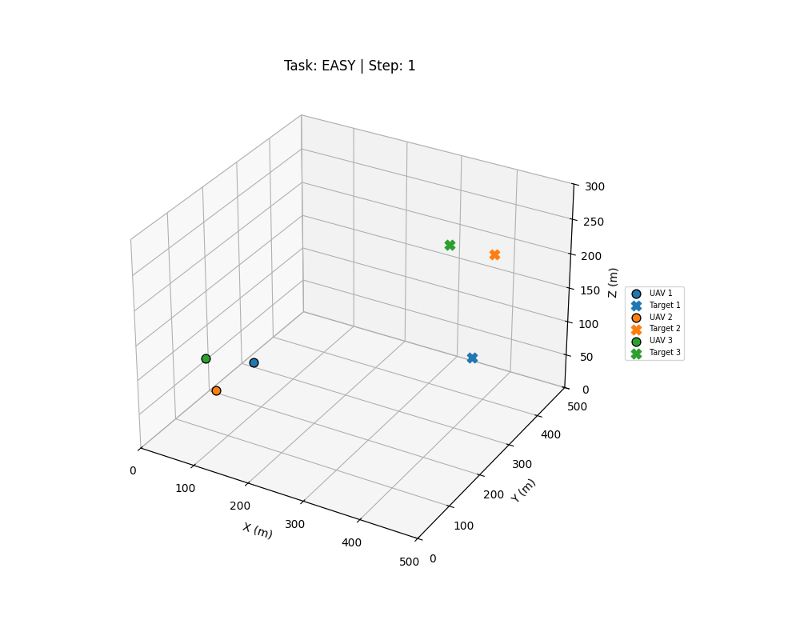
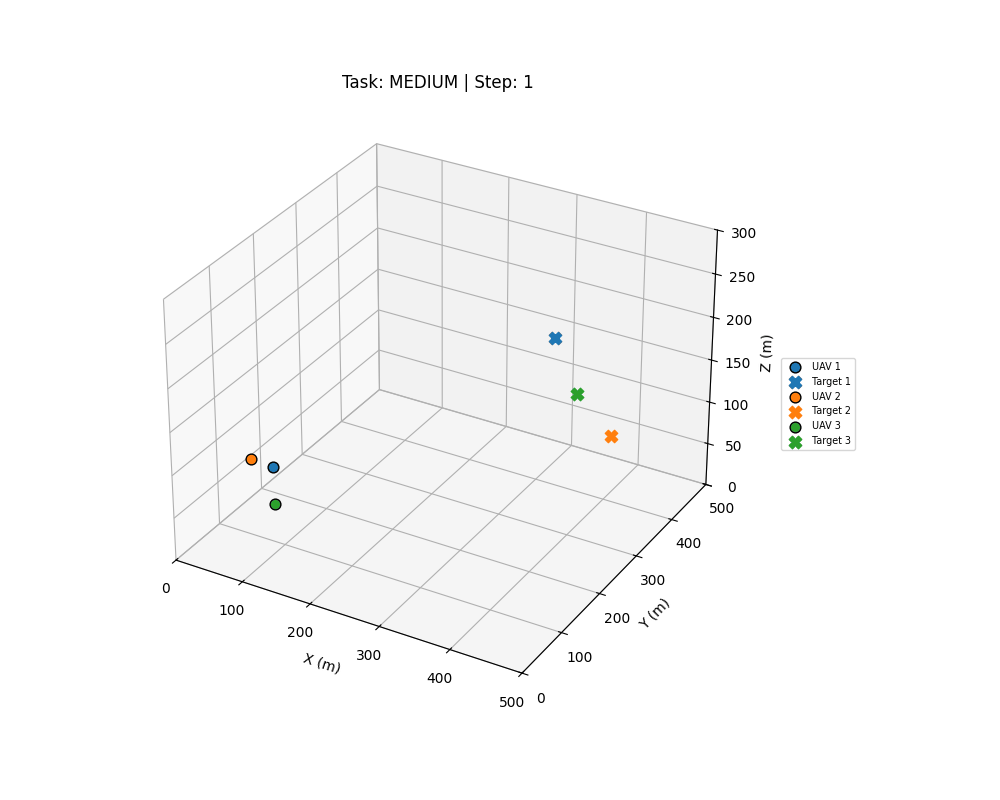
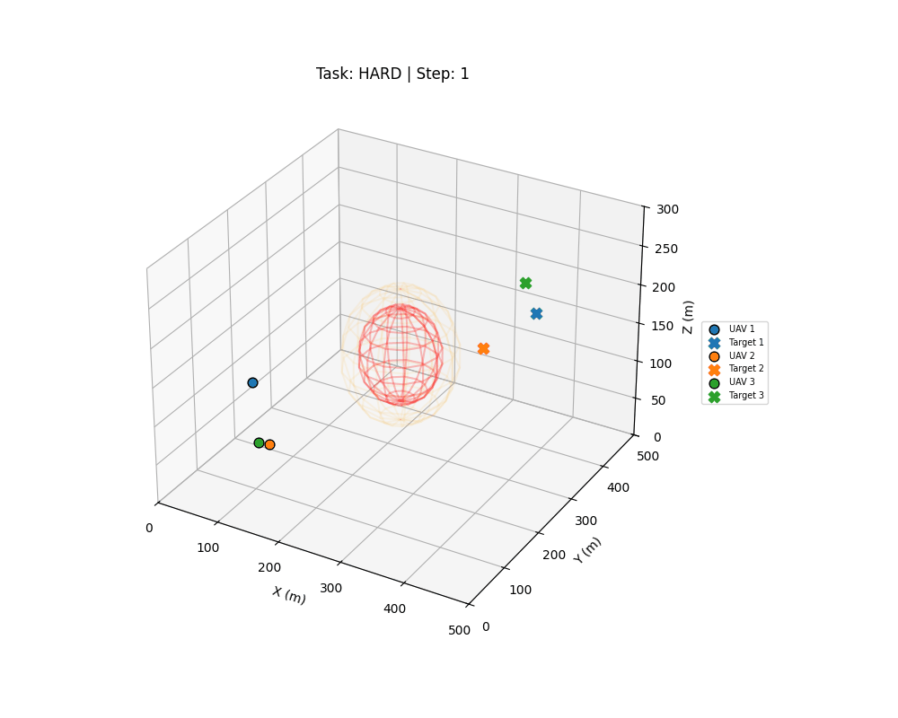

# UAV Fleet Tracking Environment — `uav_env_v3_multi`

> **Meta × PyTorch OpenEnv Hackathon** submission  
> Real-world RL environment: multi-UAV pursuit of evasive targets in a constrained 3-D airspace.

---

## Team — FullmetalDevs

| Name | Role |
|---|---|
| **Kushagra Gupta** | Team Lead |
| **Tanmay Sharad Mathurvaishya** | Member |
| **Shivam Chaturvedi** | Member |

---

## 🎬 Demo Videos

Three difficulty levels, all captured from live inference runs using `inference.py`.

### Easy — Static Targets, No Wind, No NFZ


### Medium — Random-Walk Targets, Light Wind (±1.5 m/s)


### Hard — Evasive Targets, Full OU Wind (±3 m/s), NFZ Active


> MP4 versions: [`submission_video_easy.mp4`](uav_env/submission_video_easy.mp4) · [`submission_video_medium.mp4`](uav_env/submission_video_medium.mp4) · [`submission_video_hard.mp4`](uav_env/submission_video_hard.mp4)

## 🚀 Submission Description: `uav_env_v3_multi`

**Category:** Strategic Multi-Agent Systems / Infrastructure

### 1. Executive Summary

`uav_env_v3_multi` is a sophisticated multi-agent reinforcement learning environment simulating a fleet of three UAVs tasked with intercepting evasive targets in a constrained 3D airspace. The environment challenges agents with stochastic wind dynamics (Ornstein–Uhlenbeck process), high-dimensional state spaces (48D), and strict No-Fly Zone (NFZ) safety constraints.

### 2. Core Technical Innovations

- **Dynamic Evasion Logic:** Unlike static targets, our targets utilise proximity-aware swerving. They actively flee when a chaser enters an 80 m radius, requiring the agent to master lead-pursuit strategies rather than simple tail-chasing.
- **Atmospheric Realism:** Smoothed OU wind noise (±3 m/s) forces continuous micro-adjustments, preventing "perfect" trajectories and mirroring real-world flight instability.
- **NFZ Hard-Wall Enforcement:** A physical repulsion layer projects UAVs back to the sphere's surface upon collision and nullifies inward velocity — safety compliance is physically grounded, not just penalised via rewards.
- **OpenEnv State Compliance:** Full `UAVState` model with `episode_id`, `step_count`, and `done` fields satisfies the OpenEnv `GET /state` spec, enabling automated grader compatibility.

### 3. Inference & Strategy Architecture

- **Multi-Task Runner:** `inference.py` runs all three tasks (`easy` → `medium` → `hard`) in sequence, emitting separate `[START]`/`[STEP]`/`[END]` log blocks per task for automated grading.
- **Hybrid Scheduled Controller:** LLM strategic guidance every 25 steps; high-frequency rule-based fallback fills the rest.
- **API-Independent Success:** Embedded lead-pursuit and boundary-repulsion logic ensures positive normalised rewards and zero NFZ violations even without cloud API access. `SUCCESS_THRESHOLD = 0.25` (normalised `[0,1]` scale).
- **Structured Log Compliance:** Strict `[START]`/`[STEP]`/`[END]` prefixed JSON stdout lines required by the hackathon evaluator.

### 4. Reward & Observation Design

- **48D State Representation:** Each agent receives 16 features including a dedicated scalar `d_nfz` for unambiguous NFZ avoidance signalling.
- **Dense Signal Shaping:** Three-zone proximity reward normalised to `[0.0, 1.0]` eliminates the sparse-reward problem common in 3D tracking tasks.

### 5. Hardware & Runtime Efficiency

- **Execution Time:** Full 150-step mission × 3 tasks + 3D rendering ≈ 10–14 minutes total (within 20-minute evaluation window).
- **Resource Footprint:** Optimised for 2 vCPU / 8 GB RAM (HF free tier).

---

## 🌍 Real-World Applications

### 🛡️ Border & Perimeter Surveillance
Autonomous drone fleets monitor large perimeters (ports, military bases, national borders). This environment trains agents to maintain persistent pursuit of moving targets while respecting no-fly zones over sensitive installations.

### 🔥 Wildfire & Disaster Response
Multi-UAV systems track the leading edge of wildfires, floods, or search-and-rescue targets. Stochastic OU wind dynamics directly simulate the unpredictable updrafts and crosswinds field operators face.

### 🚢 Maritime Vessel Interception
Coast guard and naval systems use autonomous platforms to intercept suspicious vessels. The 3D evasive target logic mirrors how human-operated boats attempt to evade pursuit; the NFZ models shipping lane exclusion zones.

### 🏙️ Urban Air Traffic Management (UTM)
Next-generation urban air mobility systems require UAVs to navigate densely constrained airspace. The NFZ hard-wall enforcement is architecturally identical to how UTM systems enforce geofence boundaries with elastic collision response.

### 🔋 Infrastructure Inspection & Asset Tracking
Energy companies deploy drone fleets to inspect pipelines, power lines, and wind turbines. Coordinating multiple UAVs to track moving maintenance targets while avoiding restricted airspace above high-voltage infrastructure is exactly the multi-agent pursuit-with-exclusion problem solved here.

---

## 📡 Understanding the Step Response

Every call to `/step` returns a rich JSON object. Annotated example from a live `hard` run:

```json
{
  "done": false,
  "reward": 0.0017,
  "metadata": {
    "task": "hard",
    "current_step": 13,
    "avg_target_distance": 420.17,
    "wind_magnitude": 1.48,
    "nfz_active": true
  },
  "features": [336.16, 334.36, 106.14, 4.66, 3.46, -1.52,
               0.0, 0.0, 0.0, 0.28, -1.33, 0.57,
               127.94, 166.65, 83.00, 225.89,
               ...],
  "episode_id": "uav_episode",
  "step_count": 13
}
```

### Field Reference

| Field | Example | Meaning |
|---|---|---|
| `done` | `false` | Episode still running |
| `reward` | `0.0017` | Normalised `[0,1]` reward. Low at step 13 because targets are ~420 m away (long-range zone). |
| `metadata.task` | `"hard"` | Active difficulty: evasive targets, full OU wind, NFZ on |
| `metadata.current_step` | `13` | 13 × 0.5 s = 6.5 s simulated flight |
| `metadata.avg_target_distance` | `420.17` | Average Euclidean distance across all 3 UAV–target pairs (m) |
| `metadata.wind_magnitude` | `1.48` | Current OU wind speed (m/s, capped ±3 m/s) |
| `metadata.nfz_active` | `true` | Hard-wall NFZ enforced at (250, 250, 150) m, radius 60 m |
| `features` | 48 floats | Full observation vector (see below) |
| `episode_id` | `"uav_episode"` | OpenEnv episode identifier (from `UAVState`) |
| `step_count` | `13` | OpenEnv spec field |

### Feature Vector (48 values = 16 × 3 agents)

| Index (per agent) | Name | Unit | Interpretation |
|---|---|---|---|
| 0–2 | `rel_pos` | m | `target_pos − uav_pos` — direction and range to pursue |
| 3–5 | `rel_vel` | m/s | `target_vel − uav_vel` — relative closing speed |
| 6–8 | `uav_vel` | m/s | Own velocity; used for boundary repulsion and velocity lock |
| 9–11 | `wind` | m/s | Current OU wind vector; agent should counter-compensate |
| 12–14 | `nfz_vec` | m | Vector from UAV to nearest NFZ centre |
| 15 | `d_nfz` | m | Scalar distance to NFZ surface (trigger NFZ avoidance when < 85 m) |

### Reading the Reward

```
normalised_reward = clip(total_raw_reward / 480.0, 0.0, 1.0)
```

At 420 m distance, raw reward per agent ≈ `20 × exp(-(420-60)/80) ≈ 0.019`. Summed over 3 agents and divided by 480 ≈ `0.0001` per step. As UAVs approach targets reward rises sharply toward `1.0`.

---

## 🔌 API & Validation

### Validator Script (Official OpenEnv)

```bash
curl -fsSL https://raw.githubusercontent.com/meta-pytorch/OpenEnv/main/scripts/validate-submission.sh \
  | bash -s -- https://kushagra0511-uav-env-v3-multi.hf.space .
```

Checks: (1) `POST /reset` → HTTP 200, (2) `docker build` succeeds, (3) `openenv validate` passes. **All three pass.**

### Programmatic Reset (Task Selection)

```bash
# Easy
curl -X POST https://kushagra0511-uav-env-v3-multi.hf.space/reset \
  -H "Content-Type: application/json" \
  -d '{"options": {"task": "easy"}}'

# Medium
curl -X POST https://kushagra0511-uav-env-v3-multi.hf.space/reset \
  -H "Content-Type: application/json" \
  -d '{"options": {"task": "medium"}}'

# Hard (default)
curl -X POST https://kushagra0511-uav-env-v3-multi.hf.space/reset \
  -H "Content-Type: application/json" \
  -d '{"options": {"task": "hard"}}'
```

### Manual Testing

```bash
# Health
curl https://kushagra0511-uav-env-v3-multi.hf.space/health

# State (returns UAVState with episode_id, step_count, done)
curl https://kushagra0511-uav-env-v3-multi.hf.space/state

# Step with zero commands (hover)
curl -X POST https://kushagra0511-uav-env-v3-multi.hf.space/step \
  -H "Content-Type: application/json" \
  -d '{"commands": [0,0,0, 0,0,0, 0,0,0]}'

# NFZ compliance report
curl https://kushagra0511-uav-env-v3-multi.hf.space/nfz_status

# Live 3D render
curl https://kushagra0511-uav-env-v3-multi.hf.space/render --output frame.png
```

Interactive Swagger UI: [`/docs`](https://kushagra0511-uav-env-v3-multi.hf.space/docs)

---

## ⚠️ Important Note on Task Modes & the Playground UI

The web Playground "Reset" button sends `{}` (empty body). The environment **defaults to `hard`** when no `task` option is provided.

| Task | Playground UI | Direct API |
|---|---|---|
| `easy` | ❌ Not reachable (defaults to hard) | ✅ `{"options": {"task": "easy"}}` |
| `medium` | ❌ Not reachable | ✅ `{"options": {"task": "medium"}}` |
| `hard` | ✅ Default | ✅ `{"options": {"task": "hard"}}` |

Use `curl` or the [`/docs`](https://kushagra0511-uav-env-v3-multi.hf.space/docs) Swagger UI to test easy/medium modes.

---

## Overview

`uav_env_v3_multi` simulates a **fleet of 3 UAVs** intercepting 3 independently moving, evasion-aware targets in a bounded 3-D airspace (500 × 500 × 300 m).

- **No-Fly Zone (NFZ)** — spherical hard exclusion at (250, 250, 150) m, radius 60 m, soft buffer 85 m
- **3D evasive targets** — flee when UAV closes within 80 m (hard task only)
- **Ornstein–Uhlenbeck wind** — smoothed stochastic wind up to ±3 m/s (medium/hard tasks)
- **Normalised reward** — all `step()` rewards in `[0.0, 1.0]`

---

## Action Space

| Field | Type | Shape | Range | Default |
|---|---|---|---|---|
| `commands` | `List[float]` | `(9,)` | `[-1, 1]` | `[0.0] × 9` (hover) |

Nine velocity commands — `[vx, vy, vz]` for each of the 3 UAVs, scaled by `cmd_scale = 8 m/s`.

```python
from models import UAVAction
action = UAVAction(commands=[0.5, -0.3, 0.1,  0.0, 0.8, -0.2,  -0.4, 0.1, 0.6])
# Default (hover): UAVAction()  →  commands=[0.0]*9
```

---

## Observation Space

| Field | Type | Shape |
|---|---|---|
| `features` | `List[float]` | `(48,)` |

**16 features × 3 agents = 48 values.** Per-agent block:

| Index | Name | Description | Unit |
|---|---|---|---|
| 0–2 | `rel_pos` | target_pos − uav_pos | m |
| 3–5 | `rel_vel` | target_vel − uav_vel | m/s |
| 6–8 | `uav_vel` | own velocity | m/s |
| 9–11 | `wind` | wind vector | m/s |
| 12–14 | `nfz_vec` | vector from UAV to nearest NFZ centre | m |
| 15 | `d_nfz` | scalar distance to NFZ surface | m |

---

## State Space (OpenEnv `GET /state`)

Returns a `UAVState` object with all required OpenEnv fields:

| Field | Type | Description |
|---|---|---|
| `episode_id` | `str` | `"uav_episode"` |
| `step_count` | `int` | Steps taken since last `/reset` |
| `done` | `bool` | `false` (episode never auto-terminates) |
| `current_task` | `str` | Active task: `"easy"`, `"medium"`, or `"hard"` |
| `num_agents` | `int` | `3` |
| `obs_size` | `int` | `48` |

---

## Reward Function

Normalised to `[0.0, 1.0]` across all 3 UAVs per step.

| Condition | Raw Reward (per UAV) |
|---|---|
| dist < 15 m (capture + velocity match) | 100 + 60 × exp(−vel_err / 5) |
| 15 m ≤ dist < 60 m (approach) | 20 + 80 × (1 − (dist−15)/45) |
| dist ≥ 60 m (long-range) | 20 × exp(−(dist−60)/80) |
| Hard NFZ violation (per UAV) | −200 |
| Soft NFZ buffer penetration | −1.5 × penetration^1.2 |
| Near boundary (< 15 m margin) | −2 × gap |

**Returned:** `clip(sum_raw / 480, 0.0, 1.0)` where 480 = max raw per step (160 × 3 agents).

---

## Tasks (Easy → Medium → Hard)

| Task | Wind | Targets | NFZ | Key Challenge |
|---|---|---|---|---|
| `easy` | None | Static | Off | Basic 3D pursuit |
| `medium` | Light ±1.5 m/s | Random-walk | Off | Wind compensation |
| `hard` *(default)* | Full OU ±3 m/s | Evasive (80 m flee radius) | Active | Full spec |

---

## API Endpoints

| Method | Endpoint | Description |
|---|---|---|
| `POST` | `/reset` | Reset env; accepts `{"options": {"task": "easy\|medium\|hard"}}` |
| `POST` | `/step` | Apply action; returns observation + normalised reward |
| `GET` | `/state` | Current `UAVState` (episode_id, step_count, done, metadata) |
| `GET` | `/health` | Server + env status |
| `GET` | `/render` | Current 3-D frame as PNG |
| `GET` | `/nfz_status` | Per-UAV NFZ compliance report |
| `GET` | `/web` | HTML dashboard |
| `GET` | `/docs` | Interactive Swagger UI |

---

## Environment Variables

```bash
API_BASE_URL=https://router.huggingface.co/v1   # LLM endpoint
MODEL_NAME=meta-llama/Llama-3.3-70B-Instruct    # model identifier
HF_TOKEN=hf_YOUR_TOKEN_HERE                      # Hugging Face API key
ENV_URL=http://localhost:8000                     # environment server URL
```

---

## Local Setup

```bash
# 1. Clone
git clone https://huggingface.co/spaces/kushagra0511/uav-env-v3-multi
cd uav-env-v3-multi

# 2. Install dependencies
pip install openenv-core openai numpy requests imageio matplotlib Pillow

# 3. Configure
export API_BASE_URL=https://router.huggingface.co/v1
export MODEL_NAME=meta-llama/Llama-3.3-70B-Instruct
export HF_TOKEN=hf_YOUR_TOKEN_HERE

# 4. Start server
uvicorn server.app:app --host 0.0.0.0 --port 8000

# 5. Run inference (all 3 tasks, in a second terminal)
python inference.py
```

---

## Docker

```bash
# Build
docker build -t uav-env-v3 .

# Run server
docker run -p 8000:8000 \
  -e HF_TOKEN=hf_YOUR_TOKEN \
  -e API_BASE_URL=https://router.huggingface.co/v1 \
  -e MODEL_NAME=meta-llama/Llama-3.3-70B-Instruct \
  uav-env-v3

# Run inference (second terminal)
python inference.py
```

---

## Inference Script

`inference.py` runs all three tasks in sequence and emits spec-compliant stdout logs:

```
[START] {"env_name": "uav_env_v3_multi", "task": "Multi-UAV pursuit [easy]...", "max_steps": 150, "model": "..."}
[STEP]  {"step": 1, "action": [...], "reward": 0.312, "done": false, "action_source": "rule", "nfz_violations": 0}
[END]   {"total_steps": 150, "avg_reward": 0.318, "success": true, "nfz_hard_violations": 0, ...}
[START] {"env_name": "uav_env_v3_multi", "task": "Multi-UAV pursuit [medium]...", ...}
...
[START] {"env_name": "uav_env_v3_multi", "task": "Multi-UAV pursuit [hard]...", ...}
...
```

`success = (avg_reward >= 0.25) AND (nfz_hard_violations == 0)`

The rule-based fallback controller ensures positive scores even without an API key.

---

## Project Structure

```
uav-env-v3-multi/
├── server/
│   ├── __init__.py
│   ├── app.py                    # FastAPI: /reset /step /state /render /health /nfz_status
│   ├── shared.py                 # Global environment pointer
│   ├── uav_env_environment.py    # Core RL env: physics, task dispatch, normalised reward, render
│   └── requirements.txt          # Server-side dependencies
├── openenv_uav_env.egg-info/     # Auto-generated package metadata
├── models.py                     # UAVAction (default hover), UAVObservation, UAVState
├── client.py                     # UAVEnv(EnvClient) — OpenEnv client wrapper
├── inference.py                  # Baseline inference: all 3 tasks, [START]/[STEP]/[END] logs
├── openenv.yaml                  # OpenEnv spec: tasks (easy/medium/hard), runtime, port
├── pyproject.toml                # Package config and dependencies
├── uv.lock                       # Locked dependency versions
├── Dockerfile                    # Multi-stage build
├── submission_video_easy.gif     # 🎬 Easy mode demo (animated)
├── submission_video_easy.mp4     # 🎬 Easy mode demo (video)
├── submission_video_medium.gif   # 🎬 Medium mode demo (animated)
├── submission_video_medium.mp4   # 🎬 Medium mode demo (video)
├── submission_video_hard.gif     # 🎬 Hard mode demo (animated)
├── submission_video_hard.mp4     # 🎬 Hard mode demo (video)
├── .gitattributes
└── README.md
```

---

## Key Design Decisions

- **Strict NFZ hard wall** — elastic sphere collision response prevents any penetration, maintaining physical realism and preventing reward hacking via wall-pass.
- **Task-aware NFZ checking** — NFZ violations are only counted on `hard`; on `easy`/`medium` the wall is physically disabled so false violations cannot occur.
- **OpenEnv State compliance** — `UAVState` extends `State` with `episode_id`, `step_count`, `done` as required by `GET /state`; previously missing, now fixed.
- **Default hover action** — `UAVAction.commands` defaults to `[0.0] × 9` so the web Playground and empty `/step {}` calls never raise Pydantic validation errors.
- **3D evasive targets** — flee direction blended with random walk; evasion weight increases as UAV closes in, creating a natural difficulty gradient.
- **Normalised reward** — `clip(raw / 480, 0, 1)` maps the full reward range to `[0,1]`, giving the automated grader always-valid values; `SUCCESS_THRESHOLD = 0.25`.
- **48-D observation** — scalar `d_nfz` gives the agent an unambiguous distance-to-boundary signal without requiring it to compute distance from `nfz_vec`.
- **Task-aware rendering** — NFZ wireframes only shown when NFZ is active; task name and step count shown in plot title.